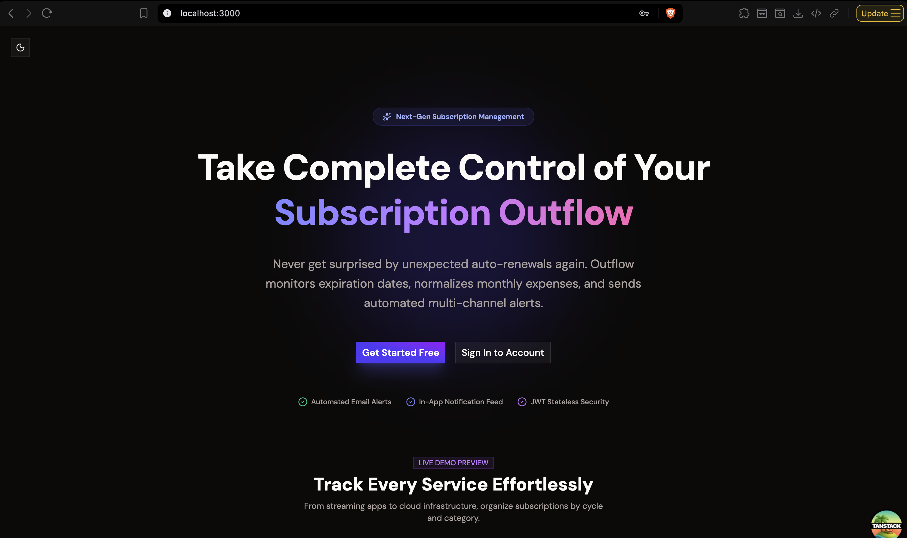
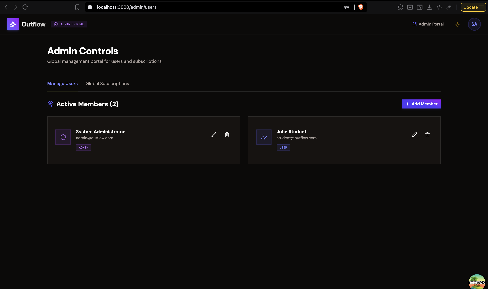
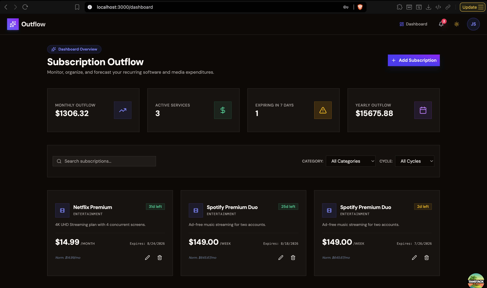
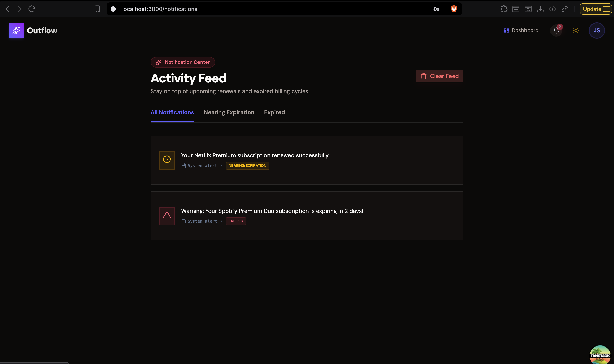
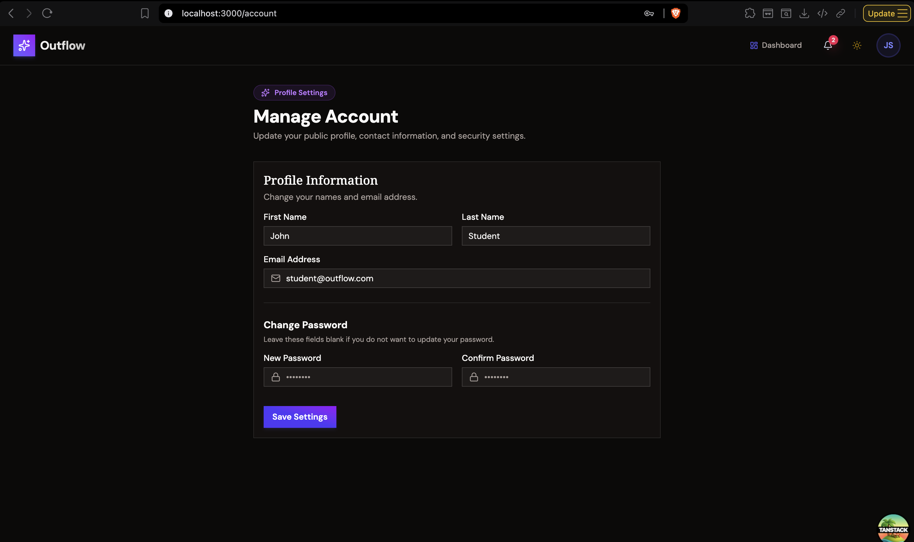

# Outflow

A full-stack subscription tracking application with automated expiration warnings and in-app/email notifications.

> **Note**
>
> The backend is built using the **Spring Framework (Spring MVC)** directly and **does not use Spring Boot**. Configuration, dependency injection, servlet initialization, security, database persistence, transaction management, and scheduled tasks are all explicitly configured in Java code to explore Spring Framework internals.

---

## Table of Contents

- [Screenshots](#screenshots)
- [Features](#features)
- [Architecture & Tech Stack](#architecture--tech-stack)
- [Project Structure](#project-structure)
- [Getting Started](#getting-started)
  - [Prerequisites](#prerequisites)
  - [Running with Docker Compose](#running-with-docker-compose)
  - [Running Locally (Development)](#running-locally-development)
    - [Backend](#backend)
    - [Frontend](#frontend)
  - [Configuration](#configuration)
  - [Default Credentials](#default-credentials)
- [Security & Authentication](#security--authentication)
- [API Reference](#api-reference)
  - [Authentication](#authentication)
  - [User Account](#user-account)
  - [User Subscriptions](#user-subscriptions)
  - [Notifications](#notifications)
  - [Admin Users](#admin-users)
  - [Admin Subscriptions](#admin-subscriptions)
- [Background Scheduler & Notifications](#background-scheduler--notifications)
- [References](#references)
- [Lessons Learned](#lessons-learned)
- 
---

# Screenshots






---

# Features

- **Subscription Tracking**: Manage subscriptions, billing cycles, pricing, logos, and categories.
- **Automated Expiration Warnings**: Daily scheduled task (`@Scheduled`) to scan for subscriptions nearing expiration or already expired.
- **Multi-channel Notifications**:
  - **In-App Notifications**: Stored in PostgreSQL with status filtering (`EXPIRED`, `NEARING_EXPIRATION`).
  - **Email Alerts**: Automated email dispatch using Spring JavaMailSender & Jakarta Mail.
- **JWT Security & RBAC**: Stateless authentication with JSON Web Tokens and Role-Based Access Control (`ROLE_USER` and `ROLE_ADMIN`).
- **Data Seeding**: Automatic database initialization with test admin and user accounts on startup.
- **Aspect-Oriented Logging**: Execution logging across service methods using AspectJ AOP.
- **Object Mapping**: Type-safe DTO-to-Entity conversion using MapStruct.
- **Reactive Frontend**: SPA built with React 19, TanStack Router, TanStack Query, and GSAP animations.

---

# Architecture & Tech Stack

Outflow follows a classic multi-tier layered architecture:

```
  React SPA (Vite + TanStack Router)
           ↓ HTTP / REST
  Controller Layer (Spring MVC REST Endpoints)
           ↓
   Service Layer (Business Logic & Notifications)
           ↓
     DAO Layer (Spring Data JPA Repositories)
           ↓
    Database (PostgreSQL 17)
```

## Backend

| Component        | Technology                            |
| ---------------- | ------------------------------------- |
| Java Version     | Java 17                               |
| Framework        | Spring Framework 6.1.5                |
| Web              | Spring MVC                            |
| Security         | Spring Security 6.5.11 + JWT (0.13.0) |
| Persistence      | Spring Data JPA 3.2.4                 |
| ORM              | Hibernate ORM 6.4.4.Final             |
| Database         | PostgreSQL 17                         |
| Connection Pool  | HikariCP 5.1.0                        |
| Mail Sender      | Spring Mail + Angus Mail 2.0.5        |
| Object Mapping   | MapStruct 1.6.3                       |
| JSON             | Jackson Datatype JSR310 2.21.2        |
| AOP              | AspectJ 1.9.25.1                      |
| Code Coverage    | JaCoCo 0.8.15                         |
| Logging          | SLF4J 2.0.13 + Logback 1.5.6          |
| Build Tool       | Maven 3.9                             |
| Containerization | Docker & Docker Compose               |

## Frontend

| Component       | Technology                          |
| --------------- | ----------------------------------- |
| Language        | TypeScript                          |
| UI Library      | React 19                            |
| Build Tool      | Vite 8                              |
| Routing         | TanStack Router (file-based)        |
| Data Fetching   | TanStack Query (React Query v5)     |
| HTTP Client     | Axios                               |
| Styling         | Tailwind CSS v4                     |
| UI Components   | shadcn/ui + Base UI                 |
| Animations      | GSAP 3                              |
| Forms           | React Hook Form                     |
| Icons           | Lucide React                        |

---

# Project Structure

```
Outflow
├── compose.yaml                      # Docker Compose (PostgreSQL, backend, frontend)
├── backend
│   └── outflow
│       ├── Dockerfile                # Multi-stage build (Maven 3.9 + Tomcat 10.1)
│       ├── pom.xml
│       └── src
│           ├── main
│           │   ├── java
│           │   │   └── com.gwynejsn
│           │   │       ├── App.java
│           │   │       ├── aop             # AspectJ Service Logging
│           │   │       ├── config          # Java Configuration (AppConfig, SecurityConfig)
│           │   │       ├── controller      # REST Controllers (Auth, User, Admin)
│           │   │       ├── dao             # Spring Data JPA Repositories
│           │   │       ├── dto             # Data Transfer Objects
│           │   │       ├── enums           # Category, Cycle, ExpirationType, Role
│           │   │       ├── exception       # Custom Exceptions & GlobalExceptionHandler
│           │   │       ├── filter          # JwtAuthenticationFilter
│           │   │       ├── model           # JPA Entities (User, Subscription, Notification)
│           │   │       ├── scheduler       # SubscriptionExpirationNotificationScheduler
│           │   │       ├── service         # AuthService, UserService, SubscriptionService
│           │   │       └── utils           # DataInitializer, MapStruct mappers
│           │   └── resources
│           │       └── application.properties
│           └── test
│               └── java
│                   └── com.gwynejsn
│                       └── SubscriptionServiceTest.java
└── frontend
    └── outflow
        ├── Dockerfile                # Node 22 Alpine image
        ├── src
        │   ├── api                   # Axios client & typed API functions
        │   ├── components            # Shared UI components (Navbar, etc.)
        │   ├── context               # AuthContext (JWT state, interceptors)
        │   ├── hooks                 # TanStack Query hooks (useSubscriptions, useAdminUsers, etc.)
        │   └── routes                # File-based routes (TanStack Router)
        │       ├── auth              # login.tsx, register.tsx
        │       └── _user             # Protected layout + dashboard, account, admin pages
        ├── package.json
        └── vite.config.ts
```

---

# Getting Started

## Prerequisites

- **Docker & Docker Compose** (recommended — runs everything automatically)

For local development only:
- **Java JDK 17+**
- **Maven 3.9+**
- **Node.js 22+** & **npm**
- **Apache Tomcat 10.1+** (for WAR deployment)

---

## Running with Docker Compose

The easiest way to get the entire stack (database, backend, frontend) running is with a single command from the project root:

```bash
docker compose up --build
```

This will spin up three containers:

| Service               | Container Name       | URL                           |
| --------------------- | -------------------- | ----------------------------- |
| Frontend (React)      | `outflow-frontend`   | http://localhost:3000         |
| Backend (Spring MVC)  | `outflow-backend`    | http://localhost:8080/outflow |
| Database (PostgreSQL) | `outflow-postgres-db`| `localhost:1997`              |

The backend container waits for the database to pass its health check before starting. The frontend container waits for the backend to be available.

To stop all services:

```bash
docker compose down
```

To stop and also remove the database volume (fresh start):

```bash
docker compose down -v
```

> **Note**: Update `spring.mail.username` and `spring.mail.password` in `backend/outflow/src/main/resources/application.properties` with your SMTP credentials before building if you want email notifications to work.

---

## Running Locally (Development)

### Backend

**1. Start the database:**

```bash
docker compose up outflow-postgres-db -d
```

**2. Build and deploy the WAR:**

```bash
cd backend/outflow
mvn clean package
```

This produces `target/outflow-1.0-SNAPSHOT.war`. Deploy it to a local Tomcat instance or run Tomcat directly:

```bash
/path/to/tomcat/bin/catalina.sh run
```

Backend base URL: `http://localhost:8080/outflow`

---

### Frontend

**1. Install dependencies:**

```bash
cd frontend/outflow
npm install
```

**2. Start the dev server:**

```bash
npm run dev
```

Frontend URL: `http://localhost:3000`

> The frontend dev server proxies API calls to `http://localhost:8080/outflow`. Ensure the backend is running before using the app.

---

## Configuration

Application configuration is in `backend/outflow/src/main/resources/application.properties`:

```properties
security.jwt.secret=55d1365cb035aab7ac0ff4abfb2182b0ee7b2ea5bbe26cbd078b9b99fe4f1356
security.jwt.expires=30
company.email=outflow@gmail.com
notification.expiration.email.lead.time=2

db.driver=org.postgresql.Driver
db.url=jdbc:postgresql://localhost:1997/outflow_db?sslmode=disable
db.user=springuser
db.pass=springpass

spring.mail.host=smtp.gmail.com
spring.mail.port=587
spring.mail.username=YOUR_USERNAME
spring.mail.password=YOUR_SMTP_KEY
```

> When running inside Docker Compose, the backend uses the internal service hostname (`outflow-postgres-db`) instead of `localhost`.

---

## Default Credentials

The `DataInitializer` bean seeds the database with mock users on startup:

| Role  | Email                   | Password     |
| ----- | ----------------------- | ------------ |
| ADMIN | `admin@outflow.com`     | `Admin123!`  |
| USER  | `student@outflow.com`   | `Student123!`|

> **Note**: Passwords must now meet the complexity requirements (min 8 chars, uppercase, lowercase, number, special character).

---

# Security & Authentication

Authentication is stateless and uses JSON Web Tokens (JWT).

### Request Header Syntax

Protected endpoints require a valid JWT token in the `Authorization` header:

```http
Authorization: Bearer <your_jwt_token>
```

### Access Control Rules

- `/api/auth/**` — Publicly accessible
- `/api/user/**` — Requires `ROLE_USER`
- `/api/admin/**` — Requires `ROLE_ADMIN`

The JWT expires after the configured number of minutes (`security.jwt.expires`). The frontend automatically clears session state and redirects to login on `401 Unauthorized` responses.

---

# API Reference

## Authentication

Base Path: `/api/auth`

| Method | Endpoint  | Access | Description                            |
| ------ | --------- | ------ | -------------------------------------- |
| POST   | `/login`  | Public | Authenticate user & receive JWT token. |
| POST   | `/create` | Public | Register a new user account.           |

---

## User Account

Base Path: `/api/user/account`

| Method | Endpoint  | Access    | Description                             |
| ------ | --------- | --------- | --------------------------------------- |
| GET    | `/`       | ROLE_USER | Retrieve current authenticated profile. |
| PUT    | `/update` | ROLE_USER | Update current authenticated profile.   |

---

## User Subscriptions

Base Path: `/api/user/subscriptions`

| Method | Endpoint       | Access    | Description                                  |
| ------ | -------------- | --------- | -------------------------------------------- |
| GET    | `/`            | ROLE_USER | Retrieve all subscriptions for current user. |
| POST   | `/create`      | ROLE_USER | Add a new subscription.                      |
| PUT    | `/update`      | ROLE_USER | Update an existing subscription.             |
| DELETE | `/delete/{id}` | ROLE_USER | Delete a subscription by UUID.               |

---

## Notifications

Base Path: `/api/user/notifications`

| Method | Endpoint | Access    | Description                                                                                        |
| ------ | -------- | --------- | -------------------------------------------------------------------------------------------------- |
| GET    | `/`      | ROLE_USER | Retrieve notifications (optional query param `expirationType`: `EXPIRED` or `NEARING_EXPIRATION`). |
| GET    | `/clear` | ROLE_USER | Clear all notifications for the authenticated user.                                                |

---

## Admin Users

Base Path: `/api/admin/users`

| Method | Endpoint        | Access     | Description                      |
| ------ | --------------- | ---------- | -------------------------------- |
| GET    | `/`             | ROLE_ADMIN | Retrieve list of all users.      |
| GET    | `/email/{email}`| ROLE_ADMIN | Retrieve a user by email.        |
| POST   | `/create`       | ROLE_ADMIN | Create a new user.               |
| PUT    | `/update`       | ROLE_ADMIN | Update an existing user.         |
| DELETE | `/delete/{id}`  | ROLE_ADMIN | Delete a user by UUID. Admins cannot delete their own account. |

---

## Admin Subscriptions

Base Path: `/api/admin/subscriptions`

| Method | Endpoint       | Access     | Description                     |
| ------ | -------------- | ---------- | ------------------------------- |
| GET    | `/`            | ROLE_ADMIN | Retrieve all subscriptions.     |
| GET    | `/{id}`        | ROLE_ADMIN | Retrieve subscription by UUID.  |
| POST   | `/create`      | ROLE_ADMIN | Create a subscription for user. |
| PUT    | `/update`      | ROLE_ADMIN | Update any subscription.        |
| DELETE | `/delete/{id}` | ROLE_ADMIN | Delete subscription by UUID.    |

---

# Background Scheduler & Notifications

Outflow runs a daily scheduled job managed by `SubscriptionExpirationNotificationScheduler` (`@Scheduled(cron = "0 0 0 * * ?")`):

1. **Email Warnings**: Finds subscriptions approaching expiration and sends warning emails using `EmailNotificationService` via `JavaMailSender`.
2. **In-App Notifications**: Generates or updates in-app notification records (`NEARING_EXPIRATION` or `EXPIRED`) stored in PostgreSQL, accessible through `/api/user/notifications`.

---

# References

- **Spring Framework**: [Documentation](https://docs.spring.io/spring-framework/reference/) \| [API Javadoc](https://docs.spring.io/spring-framework/docs/current/javadoc-api/)
- **Spring Security**: [Reference Documentation](https://docs.spring.io/spring-security/reference/)
- **Spring Data JPA**: [Reference Documentation](https://docs.spring.io/spring-data/jpa/reference/)
- **Hibernate ORM**: [User Guide](https://docs.jboss.org/hibernate/orm/current/userguide/html_single/)
- **JJWT**: [Java JWT Library](https://github.com/jwtk/jjwt)
- **PostgreSQL**: [PostgreSQL Documentation](https://www.postgresql.org/docs/)
- **TanStack Router**: [Documentation](https://tanstack.com/router/latest)
- **TanStack Query**: [Documentation](https://tanstack.com/query/latest)
- **GSAP**: [Documentation](https://gsap.com/docs/v3/)
- https://gitlab.com/ShowMeYourCodeYouTube/spring-mvc-without-spring-boot

---

## Lessons Learned

- Explored multiple approaches for database access:
  - Spring JDBC (`JdbcTemplate`)
  - Spring + Hibernate
  - Spring Data JPA
  - Manual `EntityManager` usage

- Learned how Spring Data JPA repositories leverage interfaces to reduce boilerplate CRUD implementations.

- Implemented JWT authentication and understood its internals:
  - JWT consists of a **Header**, **Payload**, and **Signature**.
  - During authentication, the server signs the header and payload using a secret key.
  - During verification, the server recomputes the signature using the same secret key and compares it with the token's signature to verify integrity and authenticity.

- Gained a deeper understanding of Spring AOP proxy mechanisms:
  - Spring uses **JDK Dynamic Proxies** when a bean implements an interface.
  - Spring uses **CGLIB proxies** when proxying concrete classes.
  - Learned why a bean implementing only `UserDetailsService` exposes only the interface methods when proxied using JDK Dynamic Proxy.
  - Understood why separating `UserDetailsService` from the business service (or enabling `proxyTargetClass=true` to force CGLIB) resolves missing method issues.
  - Chose to keep the default JDK proxy behavior in this project to better understand how Spring's proxy mechanism works.

- Learned how JPQL supports DTO projections using constructor expressions (`SELECT new ...`), allowing queries to return custom DTOs instead of full entities when only partial data is needed.

- Gained hands-on experience configuring Spring MVC, Spring Security, Hibernate, and JPA manually without relying on Spring Boot auto-configuration.

- Developed a better understanding of the Spring container, dependency injection, bean lifecycle, servlet initialization, and application context configuration.

This project served as a practical exercise in learning the Spring ecosystem by configuring each subsystem explicitly rather than relying on auto-configuration.
